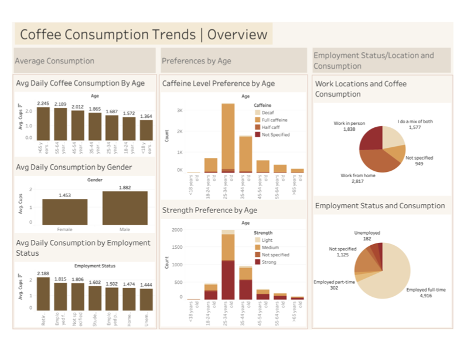

# Coffee Consumption Analysis by Demographics and Lifestyle

## Background and Overview

This project stems from firsthand exposure to the coffee industry through a family-run online coffee bean business. Although that venture eventually concluded, it revealed the lasting global fascination with coffee and the complex journey from raw bean to beloved beverage. These insights laid the foundation for a deeper exploration into consumer behavior within the coffee market.

The primary goal of this analysis is to understand how coffee consumption varies across demographic segments, particularly by age, gender, work environment, and employment status. By examining these variables, the project aims to uncover actionable insights that can help coffee retailers, marketers, and product developers better align their offerings with the preferences and habits of different consumer groups.

Key objectives of this project include:

- Identifying coffee consumption trends by age group and gender  
- Understanding how work-from-home (WFH) vs. in-office lifestyles impact coffee habits  
- Analyzing consumption patterns across employment types (full-time, part-time, student, unemployed, retired)  

By answering these questions, this study delivers data-driven recommendations to optimize marketing strategies, refine product development, and enhance consumer engagement.

---

## Data Overview

The dataset used in this project was collected through an online survey and compiled into a single CSV file and is available on tidytuesdays Repository on Github (https://github.com/rfordatascience/tidytuesday/tree/main/data/2024/2024-05-14). It initially included a wide array of variables, some of which were beyond the scope of this analysis. To maintain focus on the research objectives, the dataset was cleaned and transformed using Pandas, retaining only the most relevant features related to:

- Demographics (age, gender)  
- Coffee consumption habits (daily intake, brew preferences)  
- Lifestyle indicators (work location, employment status)  

The cleaning was done through checking for null values and handling them if needed, as well as stanardazing the categories using dictionary mapping for easier analysis.

---

## Executive Summary

This project explores coffee consumption patterns across demographics and lifestyle factors to uncover opportunities for targeted marketing, product development, and customer engagement within the coffee industry. Using cleaned survey data, the analysis focuses on three main categories: Age & Gender, Work Environment, and Employment Status.

### 1. Age & Gender

- Heaviest consumers are individuals aged 65 and older, followed closely by the 55–64 age group.  
- The lowest consumption comes from minors (<18) and young adults (18–24).  
- Full caffeine is the preferred choice across all age groups, with no significant shift toward decaf in older demographics.  
- Strong coffee is consistently preferred, except among those under 18, who prefer medium strength.  
- Males consume more coffee daily than females, and more male respondents completed the survey.  

**Marketing Implications:**

- Target older demographics with strong, full-caffeine products and consider their loyalty as daily consumers.  
- Use social media and personalized advertising to appeal to both male and female audiences.  
- For younger audiences, introduce medium-strength, trend-forward products to align with their preferences.

---

### 2. Work Environment (WFH vs. Office)

- Most respondents work from home, followed by in-office and hybrid arrangements.  
- The highest consumption was from individuals who did not specify their work setup—potentially freelancers—a segment worth further exploration.  
- Among specified groups, hybrid workers consume the most coffee on average.  

**Product Strategy Recommendations:**

- Focus on home-brewing products like pods and machines for the WFH segment.  
- Offer office-friendly solutions such as bulk coffee and preground formats for in-office teams.  
- Create hybrid-focused options like travel mugs and flexible subscription boxes that accommodate varied routines.

---

### 3. Employment Status

- Retired individuals consume the most coffee daily, followed by full-time workers.  
- Those with unspecified employment status also showed high average consumption.  

**Targeting Recommendations:**

- For retired consumers, emphasize ease of use, accessibility, and health-conscious coffee options.  
- For full-time workers, promote quick and efficient solutions that fit into busy schedules—like single-serve machines, portable brews, or energy-boosting blends.

---
## Tableau Dashboard

Below is a visual representation of some key findings from the analysis:

## Insights by Category

### 1. Age and Gender

**Which age groups are the heaviest coffee drinkers?**

- Individuals aged 65+ consume the most coffee on average, followed by those aged 55–64.  
- The lowest consumption comes from minors (<18) and young adults (18–24).

**Are older consumers more valuable daily consumers?**

- Yes. Older consumers not only drink more coffee but may also represent a more consistent and loyal customer base.

**Do caffeine preferences shift with age?**

- Across all age groups, full caffeine coffee is the dominant preference.  
- There is no significant increase in decaf or low-caffeine preference among older age groups.

**Do strength preferences vary by age?**

- Most age groups prefer strong coffee, followed by medium and light.  
- An exception is the under-18 group, which prefers medium over strong.

**Is there a gender trend in daily consumption?**

- Males reported higher average daily consumption than females.  
- More male participants responded to the survey.

**Marketing implications:**

- Ads and packaging can be tailored by gender, especially using targeted social media campaigns.  
- Older demographics are worth targeting with strong, full-caffeine options, while the younger demographics can be targeted using medium strength options.

---

### 2. Work Environment (WFH vs. Office)

**Where are people consuming the most coffee?**

- Most respondents reported working from home, followed by in-person and hybrid.  
- Interestingly, individuals who did not specify their work arrangement had the highest average daily consumption. People in this category can potentially fall into freelancers, which can be another group that can be further explored as a potential target.  
- Among the main groups, hybrid workers had slightly higher consumption than fully remote or in-person workers.

**Product strategy suggestions:**

- Home brewing products such as pods or machines should be a focus due to high WFH rates.  
- Office-friendly formats such as preground coffee as well as high volume coffee machines can still target in-office teams. Bulk savings can potentially entice these groups into purchasing.  
- Introduce WFH subscription boxes or commuter-focused travel mugs to address both ends of the spectrum, which could also cater well when targeting hybrid employees whose routine changes by the day.

---

### 3. Employment Status

**Who drinks the most coffee by employment status?**

- Retired individuals have the highest average daily consumption.  
- Full-time workers come second, followed by individuals who did not specify their employment status.

**Who should businesses target?**

- Retired individuals as well as full time workers are both high-consumption groups worth focusing on.  
- Consider developing products with ease of use, accessibility, and health-conscious options for retired individuals.  
- For full time workers, consider products that are quick and efficient so that they are more inclined to use them amongst their busy days.

---

## Conclusion

By understanding how coffee habits vary across demographics and lifestyles, businesses can strategically position their products and marketing efforts. Key focus areas include:

- Older, loyal daily consumers (age 55+ and retirees)  
- Hybrid and WFH workers needing convenient formats  
- Gender-based targeting through digital channels  
- Busy professionals needing quick, effective coffee solutions  

These insights empower brands to tailor their offerings in ways that resonate with distinct consumer segments and increase long-term engagement.

